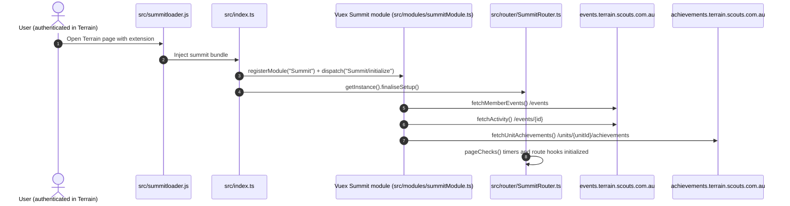
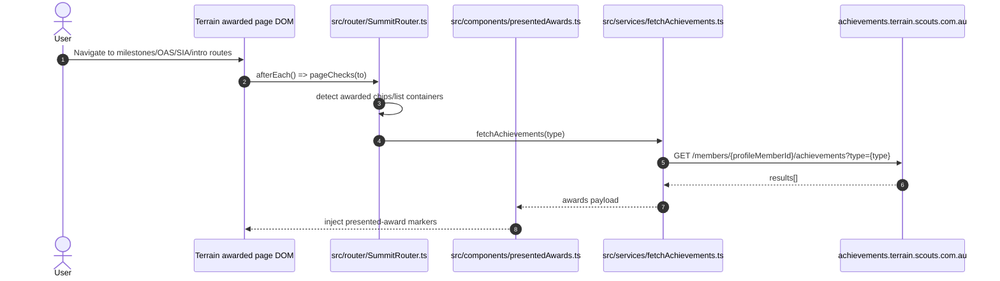
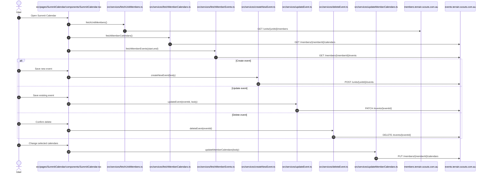
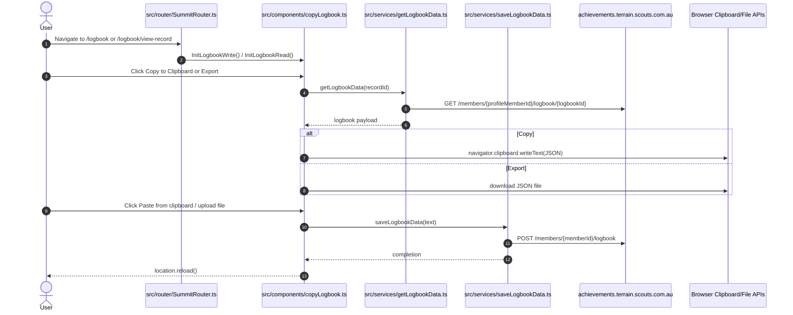
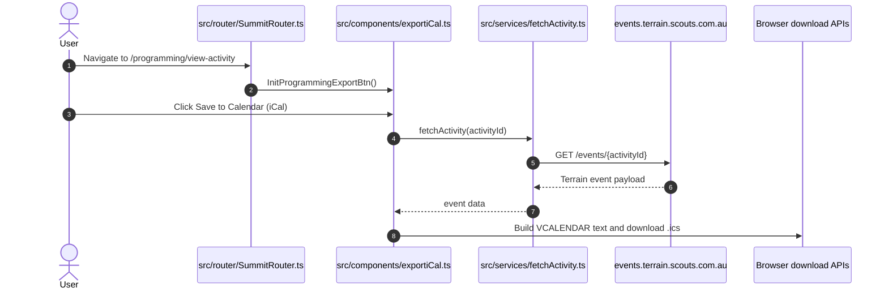

# Summit Terrain Control Flows

<!-- markdownlint-disable MD024 -->

Phase 2 reference for end-to-end runtime control flows showing how Summit user actions trigger Terrain API calls.

## Initialization flow

### Flow intent

Boot Summit into an already-authenticated Terrain page, register the Vuex module, finalize routing/menu hooks, and trigger initial data hydration.

### Runtime symbol map

1. Script injection starts in `src/summitloader.js`.
2. Runtime bootstrap executes in `src/index.ts` (`registerModule`, `dispatch("Summit/initialize")`, `finaliseSetup`).
3. Module initialization and refresh hooks are in `src/modules/summitModule.ts` (`initialize`, `getPresentedAwards`, `getAchievements`).
4. Route lifecycle and deferred checks are in `src/router/SummitRouter.ts` (`beforeEach`, `afterEach`, `pageChecks`).
5. Initialization-triggered service calls include:
   - `src/services/fetchMemberEvents.ts`
   - `src/services/fetchActivity.ts`
   - `src/services/fetchUnitAchievements.ts`

## Awards checks flow

### Flow intent

On award-related Terrain routes, Summit augments the UI by checking awarded entries and cross-referencing achievements for the active profile.

### Runtime symbol map

1. Route-triggered orchestration is in `src/router/SummitRouter.ts` (`pageChecks`, route-to-type mapping, `fetchAchievements(type)`).
2. Award decoration utilities are in `src/components/presentedAwards.ts` (`CheckAward`, `AwardObserverRouter`).
3. Achievement retrieval is implemented by `src/services/fetchAchievements.ts`.
4. Auth context/token source is `src/helpers/TerrainState.ts`.

## Calendar CRUD flow

### Flow intent

Load member calendars and events, allow create/update/delete from Summit’s calendar editor, and persist calendar visibility changes.

### Runtime symbol map

1. Calendar UI and control handlers:
   - `src/pages/SummitCalendar/components/SummitCalendar.tsx`
   - `fetchData`, `fetchCalendars`, `saveActivity`, `handleCalendarChange`, `openTerrainDialog`
2. Calendar/event service calls:
   - `src/services/fetchMemberEvents.ts`
   - `src/services/fetchMemberCalendars.ts`
   - `src/services/updateMemberCalendars.ts`
   - `src/services/createNewEvent.ts`
   - `src/services/updateEvent.ts`
   - `src/services/deleteEvent.ts`
   - `src/services/fetchActivity.ts`
3. Member lookup for editors/attendees:
   - `src/services/fetchUnitMembers.ts`

## Logbook copy/paste flow

### Flow intent

Inject copy/export/paste controls into Terrain logbook pages and bridge clipboard/download/import behaviors through Terrain logbook APIs.

### Runtime symbol map

1. Route checks that inject logbook controls are in `src/router/SummitRouter.ts` (`/logbook`, `/logbook/view-record`).
2. Logbook UI augmentation and action handlers are in `src/components/copyLogbook.ts`:
   - `InitLogbookRead`
   - `InitLogbookWrite`
   - `LoadLogbookData`
   - `WriteLogbook`
3. Logbook API wrappers:
   - `src/services/getLogbookData.ts`
   - `src/services/saveLogbookData.ts`

## iCal export flow

### Flow intent

Inject “Save to Calendar (iCal)” into Terrain programming activity pages, fetch event details, and generate/download an `.ics` file.

### Runtime symbol map

1. Route-level trigger is in `src/router/SummitRouter.ts` (`/programming/view-activity` branch in `pageChecks`).
2. iCal UI injection and export logic are in `src/components/exportiCal.ts`:
   - `InitProgrammingExportBtn`
   - `ExportiCal`
3. Event retrieval is in `src/services/fetchActivity.ts`.
